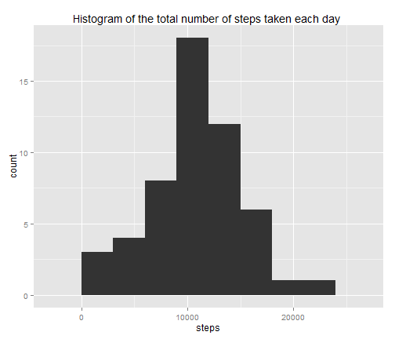
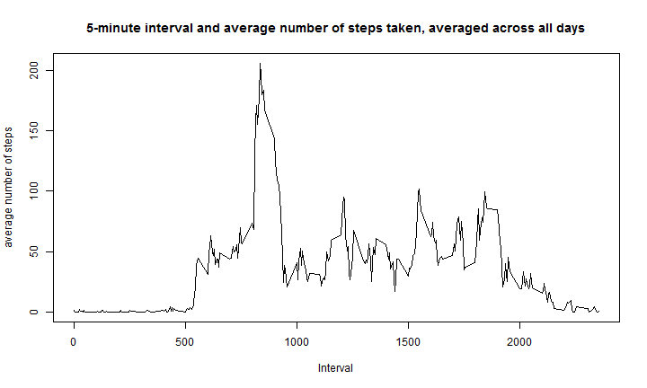
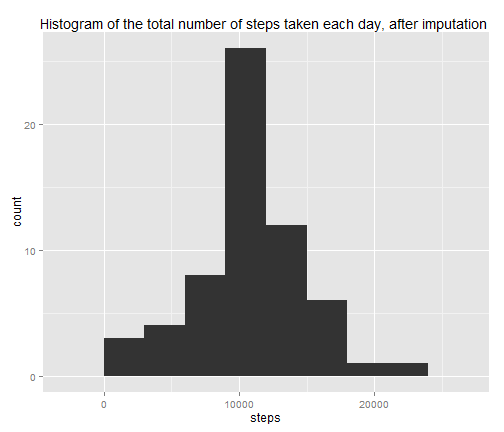

Reproducible Research/Peer Assessment 1
========================================================

The objectif of this assignment is to  write a report that answers some questions detailed below. First of all, we are going to load data and process them.

## Loading and preprocessing the data
Data are in a csv file called activity. There are a total of 17,568 observations in this dataset. The variables included in this dataset are:
* steps: Number of steps taking in a 5-minute interval (missing values are coded as NA)
* date: The date on which the measurement was taken in YYYY-MM-DD format
* interval: Identifier for the 5-minute interval in which measurement was taken

```r
library(data.table)
library(dplyr)
library(plyr)
library(reshape)
library(reshape2)
library(ggplot2)
library(lattice)
library(stats)

db = fread("activity.csv")
```

For processing data, we use the reshape library with the melt function. After that, the dcast function will permit us to have the total number of steps taken each day that is stored in the db_total dataset.


```r
db_melt = melt(db, id = c("interval", "date"), measure.vars="steps", na.rm = T)
db_total = dcast(db_melt, date ~ variable, fun = sum)
```

## What is mean total number of steps taken per day?

* Histogram of the total number of steps taken each day


```r
plot1 = ggplot()+
  geom_histogram(aes(steps), data= db_total, binwidth=3000)+
  ggtitle("Histogram of the total number of steps taken each day ")
plot1
```

 
 
* Mean and median total number of steps taken per day


```r
mean = mean(db_total$steps);
print(paste("The mean is ", mean, sep = ": "))
```

```
## [1] "The mean is : 10766.1886792453"
```

```r
median = median(db_total$steps)
print(paste("The median is ", median, sep = ": "))
```

```
## [1] "The median is : 10765"
```

The mean is 1.0766 &times; 10<sup>4</sup> and the median is 10765
## What is the average daily activity pattern?

* Time series plot  of the 5-minute interval (x-axis) and the average number of steps taken, averaged across all days (y-axis).

We first process the data with the same technique than previously


```r
db_melt2 = melt(db, id = c("interval", "date"), measure.vars="steps", na.rm = T)
db_mean2 = dcast(db_melt2, interval ~ variable, fun = weighted.mean)
```
The plotting code is below


```r
plot(db_mean2$interval, db_mean2$steps, type = "l", xlab="Interval", ylab="average number of steps",main = "5-minute interval and average number of steps taken, averaged across all days" )
```

 
 
* The 5-minute interval that contains, on average across all the days in the dataset, the maximum number of steps?

For having that 5-minute interval, we use the code below


```r
db_mean2$interval[db_mean2$steps == max(db_mean2$steps)]
```

```
## [1] 835
```
## Imputing missing values
Through the following codes, we are going to impute missing values of steps with a 
quite simple method. 
* Before that, let's compute the total number of missing values in the dataset.


```r
total = sum(is.na(db$steps))
```
The total number of missing values is 2304.

* We replace the missing value by the mean for the corresponding 5-minute interval. By the same way, we create a new dataset that is equal to the original dataset but with the missing data filled in. This dataset is called db_impute.


```r
db_impute = db
n = which(is.na(db_impute$steps))
for (i in n) {
  db_impute$steps[i] = mean(db_impute$steps[db_impute$interval == db_impute$interval[i]], na.rm = T)  
}
```
Let's check if our algorithm worked


```r
total2 = sum(is.na(db_impute$steps))
# If the result is 0, that's ok :)
```
Now, the total number of missing values is 0. 

Before doing any thing with the new dataset, let's reshape it with the previous technique


```r
db_melt3 = melt(db_impute, id = c("interval", "date"), measure.vars="steps", na.rm = T)
db_total3 = dcast(db_melt3, date ~ variable, fun = sum)
```

* Now, we're going to make a histogram of the total number of steps taken each day.


```r
plot2 = ggplot()+
  geom_histogram(aes(steps), data= db_total3, binwidth=3000)+
  ggtitle("Histogram of the total number of steps taken each day, after imputation ")
plot2
```

 
 

Here is a comparison between the previous and new mean and median


```r
mean2 = mean(db_total3$steps);
print(paste("The new mean is ", mean2, ". But the previous was ", mean , sep = ": "))
```

```
## [1] "The new mean is : 10766.1886792453: . But the previous was : 10766.1886792453"
```

```r
median2 = median(db_total3$steps)
print(paste("The new median is ", median2, ". But the previous was ", median , sep = ": "))
```

```
## [1] "The new median is : 10766.1886792453: . But the previous was : 10765"
```
The new mean is 1.0766 &times; 10<sup>4</sup> and the previous was  1.0766 &times; 10<sup>4</sup>.

The new mean is 1.0766 &times; 10<sup>4</sup> and the previous was  10765.

We notice that the mean has definitely not changed. Only the median has slightly changed. 

Also, comparing the two histograms, we remark that there is almost no change in the shape of the figure. But the maximum has changed a little bit. So we can conclude that the imputing process haven't had a significant impact on the estimates of the total daily number of steps.

## Are there differences in activity patterns between weekdays and weekends?

* To answer this question, we're going to create first a new factor variable in the dataset with two levels - "weekday" and "weekend" indicating whether a given date is a weekday or weekend day.


```r
db_impute$date = as.Date(db_impute$date)
```

```
## Warning: unable to identify current timezone 'T':
## please set environment variable 'TZ'
## Warning: unknown timezone 'localtime'
```

```r
weekday = weekdays(db_impute$date)
weekday[is.element(weekday, c("samedi","dimanche","saturday","sunday"))] = "weekend"
weekday[!is.element(weekday,c("weekend"))] = "weekday"

db_impute = cbind(db_impute, weekday )
```

* The second step is to make a panel plot containing a time series plot of the 5-minute interval and the average number of steps taken, averaged across all weekday days or weekend days. We chose to do it with the lattice plotting system.


```r
xyplot(steps ~ interval | weekday, data = db_impute, layout = c(1,2), type="l",  xlab = "Interval", ylab = "Number of steps")
```

 
 

That's all for this "Peer Assessment 1" assignment. Hope that it has been done well, and that it will help other people that might need it :) .


